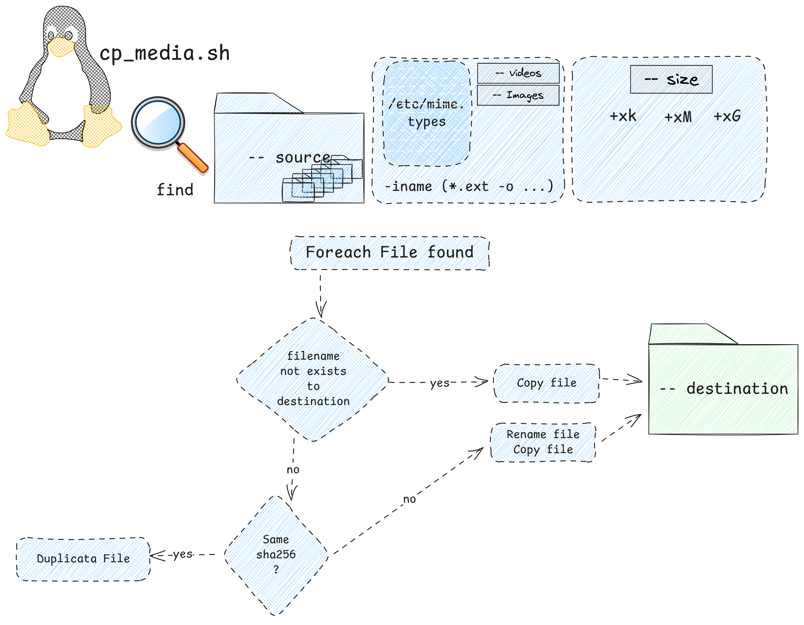

# Help page

## Name

cp_media / copy media file from source folder to destination folder

## Synopsis

cp_image --source {SOURCEFOLDER} --destination {DESTINATIONFOLDER} --images|--videos [--size +100k] [--verbose]

## Option

* `--source`: Source folder where the images are stored
* `--destination`: Destination folder where the images will be store (multiple file with the same name will be rename like filename_cX.* where X is a counter)
* `--images`:Export only images (extension come from mime type file)
* `--videos`:Export only videoss (extension come from mime type file)
* `--size`: Is the size parameter from find command e.g. +500k +1M +1G
* `--verbose`: Set verbose mode to explain everystep into console



## Installation

Installation is not mandatory you can run the script directly.

* add execution right to install.sh file `sudo chmod +x install.sh`
* Execute the install script  `/install.sh`this script do:
  * Create directory /home/$USER/.local/share/bin
  * Create symbolic link with cp_image.sh into this directory
  * Expose what you need to add into the $PATH environment
  * Expose what you neet to add into the .bashrc to store the new value into $PATH

## Exemple

```bash

    #!/bin/bash
    ./cp_image.sh --source /home/$USER/ --destination /tmp/$USER/IMG/ --images --size +500k
```

[Video on PeerTube](https://peertube.mesnumeriques.fr/w/vmhFckc7qFPaDvgEQ9GDPr)
[<- Main Page>](README.md)
